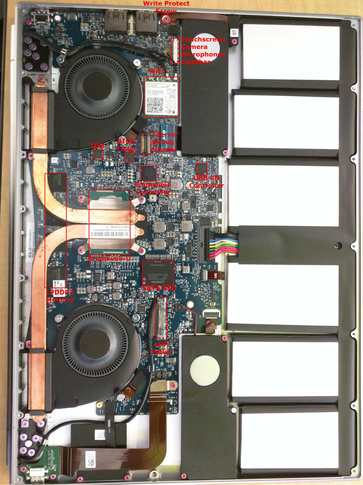

# `samus-firmware`
`samus` is the codename for the Google Chromebook Pixel 2015.

## Resources/links
- MrChromebox custom firwmare:
    - Coreboot: https://github.com/MrChromebox/coreboot
    - EC firmware: https://github.com/MrChromebox/chrome-ec/tree/firmware-samus-6300.B
        - About EC firmware sync, EC firmware is in coreboot CBFS and can be removed to prevent sync: https://github.com/MrChromebox/firmware/issues/335
    - Flashing scripts for reference on how to flash things, preserving parts from original firmware, etc.: https://github.com/MrChromebox/scripts
    - Keyboard function row remapping, can disable via coreboot: https://github.com/MrChromebox/firmware/issues/349

Source: https://www.reddit.com/r/chromeos/comments/7x87dy/anyone_have_spare_parts_for_2015_pixel_or_suggest/

Servo debug board information: https://chromium.googlesource.com/chromiumos/third_party/hdctools/+/HEAD/docs/servo_v2.md
